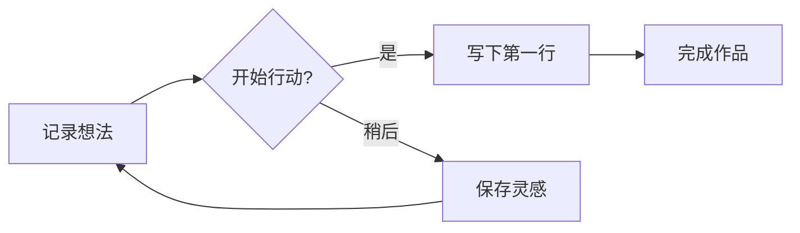
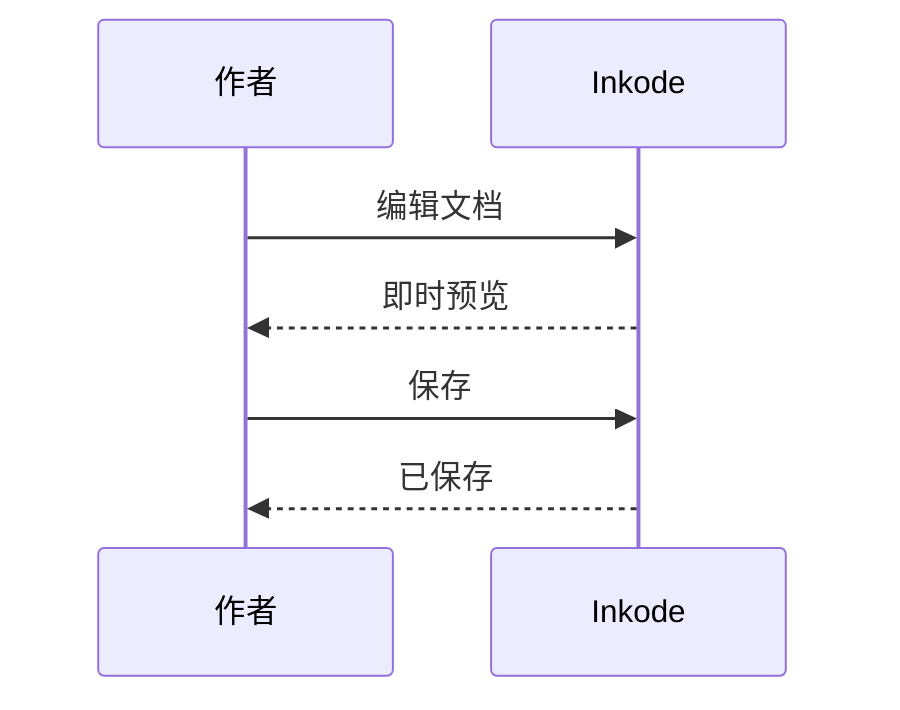

# Mermaid examples

在 Inkode 即时预览中，光标离开代码块后显示图形；点击“编辑源码”可修改。

## Flowchart

```mermaid
flowchart LR
    A[记录想法] --> B{开始行动?}
    B -->|是| C[写下第一行]
    B -->|稍后| D[保存灵感]
    C --> E[完成作品]
    D --> A
```

## Sequence diagram

```mermaid
sequenceDiagram
    participant Writer as 作者
    participant Inkode
    Writer->>Inkode: 编辑文档
    Inkode-->>Writer: 即时预览
    Writer->>Inkode: 保存
    Inkode-->>Writer: 已保存
```

点击其他段落，查看渲染结果。
